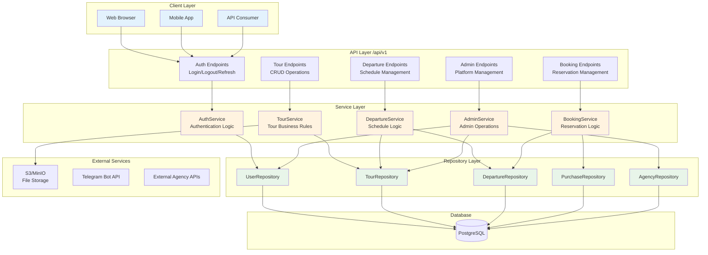

# Travellito Backend Architecture

## Clean Architecture Implementation

This backend follows Clean Architecture principles with clear separation of concerns across multiple layers.

### Architecture Layers

```
┌─────────────────────────────────────────────────────────────┐
│                    Presentation Layer                        │
│                  (FastAPI Controllers)                       │
├─────────────────────────────────────────────────────────────┤
│                    Application Layer                         │
│                   (Business Services)                        │
├─────────────────────────────────────────────────────────────┤
│                      Domain Layer                            │
│                  (Entities & Business Rules)                 │
├─────────────────────────────────────────────────────────────┤
│                  Infrastructure Layer                        │
│              (Repositories, External Services)               │
└─────────────────────────────────────────────────────────────┘
```



### Dependency Flow

- Controllers → Services → Repositories → Database
- Services → Domain Models
- All layers → Core (shared utilities)

### Key Principles

1. **Dependency Inversion**: High-level modules don't depend on low-level modules
2. **Single Responsibility**: Each class has one reason to change
3. **Interface Segregation**: Clients depend only on interfaces they use
4. **Open/Closed**: Open for extension, closed for modification

### Benefits

- **Testability**: Each layer can be tested independently
- **Maintainability**: Clear boundaries and responsibilities
- **Scalability**: Easy to add new features without affecting existing code
- **Flexibility**: Can swap implementations (e.g., different databases)

### Example Flow: Creating a Tour

1. **Controller** receives HTTP request
2. **Controller** validates request data using Pydantic schema
3. **Controller** calls **Service** with validated data
4. **Service** applies business rules and validation
5. **Service** calls **Repository** to persist data
6. **Repository** handles database operations
7. **Service** returns domain model
8. **Controller** serializes response using Pydantic schema

This architecture ensures that business logic is independent of frameworks, UI, database, and external agencies. 